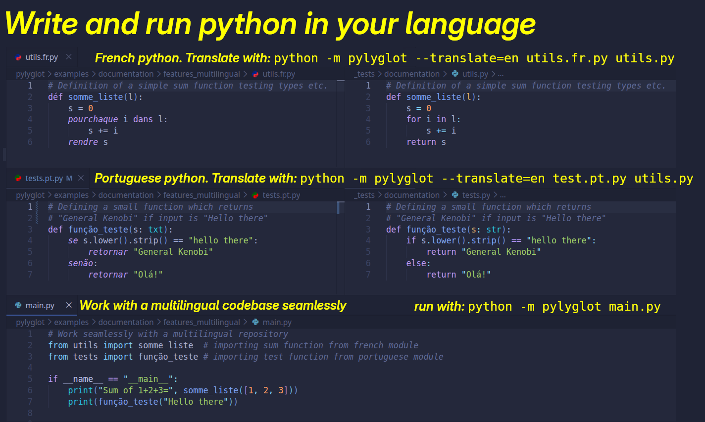

.. _en_index:

Pylyglot: write and run python code on your native language
===========================================================

`Github repository <https://github.com/AntonioRochaAZ/pylyglot>`_

Pylyglot is an extremely simple python package with no dependencies
(other than python itself) which allow you to write "python" code
with keywords from your language. Running it is as simple as running: 

``python -m pylyglot your_module.py``

Pylyglot also handles importing multilingual modules gracefully. 

With the `Pylyglot VSCode extension <>`_, syntax highlighting is also available for all
supported languages. The language is automatically recognized by the file extension: 
``.language_code.py`` (e.g. portuguese_module **.pt.py**).

.. toctree::
    :caption: Using pylyglot 
    :maxdepth: 1

    Installation <installation>
    Features <features>
    Command line options <options>
    Available languages <languages>
    Security <security>
    Settings (configs) <configs>

.. toctree::
    :caption: Contributing
    :maxdepth: 1

    On the use of AI <ai>
    Contributing <contributing>
    Supported keywords <supported_keywords>
    Contributors <contributors>

.. toctree::
    :caption: Code
    :maxdepth: 1

    pylyglot/config
    pylyglot/console
    pylyglot/hooks
    pylyglot/translator